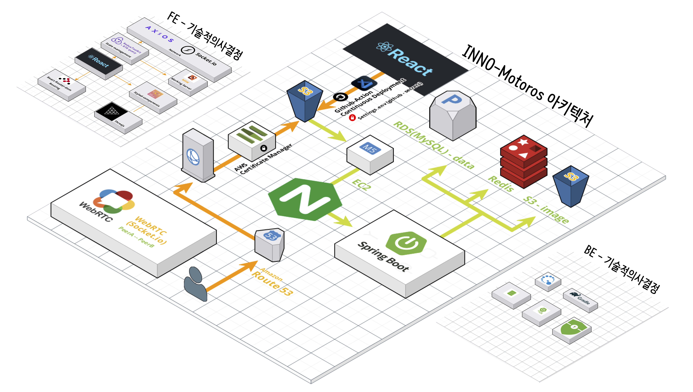

# BE-Repository

 프로젝트 개요

### 백엔드 아키텍쳐

### 사용 라이브러리

##  기술적 의사 결정
| 기술 | 이유                                                                                                                                                                                                                                                                                                                                                                          |
|----|-----------------------------------------------------------------------------------------------------------------------------------------------------------------------------------------------------------------------------------------------------------------------------------------------------------------------------------------------------------------------------|
| Java | 플랫폼 독립성, 안정성, 객체 지향의 특징을 활용하여 다양한 시스템과 장치에서 안정적으로 작동하는 애플리케이션을 구축할 수 있기 때문에 채택                                                                                                                                                                                                                                                                                              |
| Spring | 객체 지향 특성을 기반으로, 스프링 프레임워크의 유연성과 강력한 생산성 향상 도구를 활용하여 안정적이고 확장 가능한 백엔드 애플리케이션을 효과적으로 개발                                                                                                                                                                                                                                                                                       |
| Spring security | 스프링과의 연계성을 토대로 로그인, 인증, 인가 처리와 관련하여 filter로 처리가능한 기능을 제공하고 cors처리까지 처리할 수 있도록 제공 하여 사용                                                                                                                                                                                                                                                                                      |
| mySql | 명확한 스키마와 데이터 무결성, 여러 데이터의 관계성을 고려하여 rdbms 중 가장 보편적이고 많은 자료를 찾을 수 있는 mysql을 채택                                                                                                                                                                                                                                                                                               |
| Redis | refresh 토큰 사용을 위해 간단한 정보를 기존 mySql보다 빠르게 읽고 쓰기를 할 수 있도록 메모리 저장, key-value 형태의 저장소인 Redis를 채택, 추가로 만료 시간을 설정하여 데이터량을 관리 가능                                                                                                                                                                                                                                                   |
| ec2 | 비용 효율성을 갖춘 클라우드 환경에서 신속하게 가상 서버를 관리할 수 있어, 백엔드 서버의 배포와 운영을 유연하게 처리할 수 있기 때문에 채택                                                                                                                                                                                                                                                                                             |
| s3 | 데이터에 대한 세밀한 액세스 제어가 가능하며 비용효율이 좋기 때문에 채택                                                                                                                                                                                                                                                                                                                                    |
| refresh token | 보안을 위해 기존의 access token의 만료시간을 짧게 설정하면서 사용자는 불편함을 느끼지 못하도록 access token을 갱신 받을 수 있도록 도입, 추가적으로 사용자 편의성과 보안적인 부분을 고려하여 같은 계정으로 동시접속가능한 수를 제한하였으며 추가적인 접속이 들어올 경우 기존의 계정중 랜덤1개의 refresh 토큰 값을 삭제하여 logout 처리함 그 외에도 하나의 refresh token으로 두명의 사용자가 access token재발급을 각각 요청한 경우 둘중 어느쪽이 refresh token을 탈취 당한 쪽인지 알 수 없기에 그 refresh token을 삭제하여 탈취된 refresh token을 사용 할 수 없도록 처리함. |
| nginx | letsencrypt를 통한 https 설정과 Reverse Proxy 기능을 위해 도입, 이후에 서버가 늘어나거나 할 경우 nginx를 통해 로드밸런싱도 가능하여 채택, aws에서도 로드밸런서와 https를 위한 인증서를 발급 받을 수 있지만, aws 이외의 서비스를 사용하는 경우에도 적용할 수 있는 방법을 채택하는 것이 더 좋은 방법이라고 생각이 들어 채택                                                                                                                                                                  |
| querydsl | 기존의 spring에서 제공하는 jpa의 경우에도 간단한 쿼리를 요청할 경우에는 좋았지만, db내에 존재하는 값의 통계를 내기 위해서 sql에서 쿼리를 작성하는 것과 유사한 쿼리를 작성할 필요성이 생겨 Jpql을 도입하였다가 좀더 많은기능을 제공하고 compile t시점에서 에러를 발견할 수 있는 querydsl을 도입                                                                                                                                                                                         |
| Socket.io | 실시간 양방향 통신을 위해 사용. 웹소켓 프로토콜을 기반으로 하며, 웹소켓이 지원되지 않는 환경에서도 폴링 방식으로 통신이 가능하게 해줍니다. 이로 인해 다양한 환경과 브라우저에서 안정적인 실시간 통신을 구현할 수 있습니다.                                                                                                                                                                                                                                               |
| WebRTC | 웹 브라우저 간에 피어 투 피어(P2P) 방식으로 직접적인 데이터, 비디오, 오디오 통신을 가능하게 해줍니다. 별도의 플러그인이나 네이티브 앱 없이도 브라우저에서 직접 멀티미디어 통신을 할 수 있게 해주며, 낮은 지연시간과 고품질의 통신을 제공합니다.                                                                                                                                                                                                                                |
| Oauth2 | 클릭 몇 번 만으로 로그인을 할 수 있는 편리성을 통해 사용자들이 이 웹을 더 찾을 수 있는 이유를 제공하기 위함 입니다                                                                                                                                                                                                                                                                                                         |
 
### 트러블 슈팅

  
openAPI vs MySql

 기존에는 openApi를 통해 데이터를 조회하였으나 서버 상태에 따른 지연과 과도한 의존성으로 비효율적이었습니다.  초기에는 코드 최적화를 시도하여 시간을 약간 줄였으나 본질적인 문제는 openApi 서버에서 발생함을 확인하였습니다.  결국 필요한 데이터만을 선별하여 DB에 저장하고 이를 조회하는 방식으로 변경함으로써, 조회 시간을 크게 단축시킬 수 있었습니다. 

  
refresh 토큰 탈취 판단

기존의 refresh 토큰 탈취 판단은 access token 발급상태를 통해 이루어졌습니다.
 그러나 프론트쪽의 비동기요청에서 access token 재발급 상황이 여러번 발생하였고, 여기서 탈취 되었다고 판단, refresh토큰 삭제가 이루어지는 경우가 발생했습니다. 
이를 대체할 판단기준으로 발급시의 ip address를 확인하도록 했고, refresh 토큰도 매번 새로 발급해주도록 했습니다.

  
 동등연산자와 equal 

id 비교 과정에서 같은 값을 가지는 값을 비교했는데 결론은 '같지 않다'가 나왔습니다.
 원인을 찾아보니 동등 연산자(==)는 대상 주소를 비교하여 boolean 값을 반환하는데, id값의 type이 참조형 자료형 Long으로 이라 서로 다른 주소값을 가져 false 값을 반환하였습니다.  해결책으로 값 자체를 비교하기 위해 equals를 사용하였습니다.

